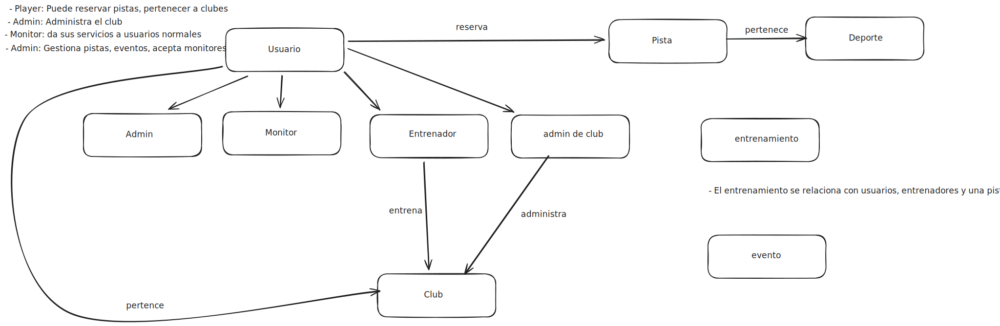

- (Guía de usuario)
- (Drag and Drop)

# Documentación Técnica: Polideportivo

- `Versión:` 3.0
- `Fecha de creación:` 11/12/2025
- `Autor:` Jordi Valls Pla
- `Arquitectura:` Microservicios (Java Spring Boot, FastAPI Python, NestJs TypeScript)

---

## Visión General del Proyecto

El proyecto "PoliCourt" es una aplicación diseñada para gestionar las pistas de un polideportivo. Permite a los usuarios reservar pistas, contratar entrenadores, inscribirse en actividades deportivas. La aplicación está construida utilizando una arquitectura de microservicios para garantizar escalabilidad y facilidad de mantenimiento.

### Stack Tecnológico:

- Frontend: React (TypeScript), Tailwind CSS
- Backend: Spring Boot (Java), FastAPI (Python), NestJS (TypeScript)
- Base de Datos: PostgreSQL, MongoDB
- Mensajería: RabbitMQ
- Pagos: Stripe API
- Infraestructura: Docker & Docker Compose

---

## Arquitectura de microservicios y comunicación entre servidores

La arquitectura se basa en dos grandes Contextos Delimitados físicos, orquestados por un API Gateway y desacoplados mediante comunicación asíncrona (mensajería con RabbitMQ).

### Topología de Servicios

#### Spring Boot (Java) - Servicio de Auth y Billing

Este servicio actúa como la fuente de verdad para la identidad y finanzas. Sigue un patrón de Monolito Modular interno.

- Módulo de Identity

  - Autenticación: Login, Registro, Refresh Tokens (JWT)
  - Gestión de usuarios: Roles (Admin, Player, Monitor, etc), Perfiles básicos
  - Seguridad: Validación de credenciales y estado de cuenta (is_active)

- Módulo de Billing

  - Pagos: Integración con Stripe (Intents, Webhooks)
  - ? Suscripciones: Planes, Renovaciones automáticas
  - ? Facturación: Historial de pagos, recibos por email

- Módulo de Clubs

  - Gestión de clubes deportivos: Creación, actualización, estado
  - Gestión de jugadores y equipos asociados a clubes

- Módulo de Professionals

  - Gestión de perfiles profesionales: Monitores, Entrenadores
  - Disponibilidad y tarifas

- Módulo de Admin

  - Herramientas administrativas: Gestión de usuarios, reportes, métricas

- Módulo de Pistas
  - Gestión de instalaciones: Pistas, mantenimiento

#### FastAPI (Python) - Servicio de Reservas y Torneos

Este servicio maneja toda la operativa de reservas.

- Módulo de Reservations
  - Búsqueda y reserva de pistas y horarios
  - Gestión de reservas: Confirmación, cancelación, historial

#### NestJs (TypeScript) - Servicio de Notificaciones y IA, Emails...

- Notificaciones push: Alertas en la app, Recordatorios, Confirmaciones
- Integración con IA: Chatbots, Recomendaciones personalizadas
- Envío de emails: Confirmaciones, Recordatorios

### Estrategia de Comunicación

#### API Gateway (Spring Cloud Gateway)

- Punto único de entrada: todo el tráfico del Frontend (React) pasa por aquí.
- Rutas
  - /api/auth/\*\* -> Servicio Spring Boot
  - /api/billing/\*\* -> Servicio Spring Boot
  - /api/reservations/\*\* -> Servicio FastAPI
  - /api/competitions/\*\* -> Servicio FastAPI
  - /api/notifications/\*\* -> Servicio NestJs

Comunicación síncrona (HTTP/REST)

- Se utiliza para operaciones que requieren respuesta inmediata.

Comunicación asíncrona (RabbitMQ)

- Se utiliza para mantener la Consistencia Eventual entre los datos distribuidos.
- (Ejemplo) Cuando se crea un usuario en el servicio de Auth, se envía un evento "UserCreated" a una cola de RabbitMQ.

## Frontend

El frontend de la aplicación "PoliCourt" está diseñado para ser intuitivo y fácil de usar, utilizando React (TypeScript), Bun, Tailwind CSS y otras bibliotecas para construir una interfaz dinámica y responsiva.

### Stack Tecnológico:

- Framework: React (TypeScript)
- Estilos: Tailwind CSS
- Librerías adicionales: React Router, Axios, Shadcn/UI, React Query

### Estructura de Carpetas Sugerida

```
src/
├── assets/            # Imágenes, fuentes, iconos globales
├── components/        # Componentes UI reutilizables y "tontos" (Buttons, Inputs, Modals)
├── config/            # Variables de entorno, configuración de librerías (axios, firebase)
├── features/          # Módulos de negocio (AQUÍ vive la lógica principal)
│   ├── auth/          # Ejemplo: Módulo de Autenticación
│   │   ├── api/       # Endpoints específicos de auth (login, register)
│   │   ├── components/# Componentes exclusivos de auth (LoginForm)
│   │   ├── hooks/     # Hooks exclusivos de auth (useAuth)
│   │   ├── types/     # Interfaces TS de auth
│   │   └── index.ts   # Punto de entrada público del módulo
│   └── dashboard/     # Ejemplo: Módulo de Dashboard
├── hooks/             # Hooks globales y genéricos (useTheme, useMediaQuery)
├── layouts/           # Estructuras de página (SidebarLayout, AuthLayout)
├── lib/               # Configuraciones de librerías de terceros (axios setup, queryClient)
├── pages/             # Las "Vistas" que conecta el Router con los Features
├── routes/            # Definición de rutas (React Router / TanStack Router)
├── stores/            # Estado global (Zustand, Redux Toolkit, Context)
├── types/             # Tipos de TypeScript globales/compartidos
├── utils/             # Funciones auxiliares puras (formatear fechas, validaciones)
├── App.tsx
└── main.tsx
```

### Vistas Principales

1. **Página de Inicio**: Presenta una visión general del polideportivo, con enlaces rápidos a las principales funcionalidades como reservas, eventos y perfil de usuario.

2. **Registro e Inicio de Sesión**: Formularios para que los usuarios puedan registrarse y acceder a sus cuentas de manera segura.

3. **Dashboard de Usuario**: Vista personalizada donde los usuarios pueden ver sus reservas, eventos inscritos y notificaciones.

4. **Gestión de Reservas**: Interfaz para buscar, reservar y gestionar pistas deportivas, con un calendario interactivo que muestra la disponibilidad.

5. **Eventos y Competencias**: Página para explorar eventos deportivos, inscribirse y ver detalles como horarios, ubicaciones y participantes.

6. **Perfil de Usuario**: Sección donde los usuarios pueden actualizar su información personal, preferencias y ver su historial de actividades.

7. **Administración**: Panel para administradores del polideportivo, con herramientas para gestionar usuarios, instalaciones, reservas y eventos.

8. **Notificaciones**: Centro de notificaciones donde los usuarios pueden ver alertas sobre sus reservas, eventos y mensajes importantes.

9. **Dashboard de Clubes**: Vista específica para clubes deportivos, permitiendo la gestión de sus jugadores, equipos y reservas de entrenamientos.

---

### Estilo y Diseño

- Utilización de Tailwind CSS para un diseño moderno y responsivo.
- Paleta de colores basada en tonos deportivos y energéticos.
- Tipografía clara y legible para mejorar la experiencia del usuario.
- Opción para la dislexia (OpenDyslexic, Lexend Deca)
- Diseño mobile-first para asegurar una experiencia óptima en dispositivos móviles y tablets.

### Flujo de Navegación

- Los usuarios pueden navegar fácilmente entre las diferentes secciones mediante la barra de navegación.
- Acceso rápido a las funcionalidades principales desde el dashboard.
- Notificaciones en tiempo real para mantener a los usuarios informados sobre sus reservas y eventos.
- Formularios intuitivos con validación para asegurar la correcta entrada de datos.
- Feedback visual para acciones exitosas o errores, mejorando la interacción del usuario con la aplicación.

---

## Diagrama de Arquitectura


---

## Tipos de Usuarios

1. **Jugador (Player)**: Usuario que reserva pistas, participa en eventos.
2. **Monitor (Coach)**: Profesional que ofrece servicios de entrenamiento y puede ser contratado por los jugadores.
3. **Entrenador (Coach)**: Usuario con permisos para gestionar equipos, organizar partidos y supervisar entrenamientos.
4. **Administrador del Club (Club Admin)**: Usuarios que representan a clubes deportivos, con capacidades para gestionar múltiples jugadores y equipos.
5. **Administrador (Admin)**: Usuario con permisos para gestionar el polideportivo, incluyendo la administración de usuarios, pistas y eventos.



---

## Flujo de Datos

El flujo de datos entre los microservicios se realiza principalmente a través de mensajería asíncrona. A continuación, se describen los flujos principales:

1. **Registro e Inicio de Sesión**:

   - El usuario envía sus credenciales al API Gateway.
   - El Gateway enruta la solicitud al servicio de Auth (Spring Boot).
   - El servicio de Auth valida las credenciales contra su base de datos y genera un JWT.
   - Si es un registro nuevo, el servicio de Auth emite un evento "User.Created" a RabbitMQ.
   - El servicio de Notificaciones (NestJs) escuchan este evento y crean una referencia mínima del usuario en su propia base de datos.

2. **Reserva de Pistas**:

   - El usuario solicita una reserva a FastAPI.
   - FastAPI pregunta al usuario si desea contratar un monitor para la sesión.
   - FastAPI crea la reserva en su base de datos.
   - FastAPI emite "Reservation.Created" a RabbitMQ.
   - El servicio de Notificaciones recibe el evento y envía una confirmación por email al usuario.

3. **Creación de Eventos Deportivos**:

   - Un administrador crea un evento en Spring Boot.
   - Spring Boot guarda el evento en su base de datos.
   - Spring Boot emite "Event.Created" a RabbitMQ.
   - El servicio de Notificaciones recibe el evento y notifica a los usuarios interesados por la web.

4. **Inscripción a Eventos**:

   - Un usuario se inscribe en un evento a través de FastAPI.
   - FastAPI actualiza la inscripción en su base de datos.
   - FastAPI publica "Event.RegistrationCreated" en RabbitMQ.
   - El servicio de Notificaciones recibe el evento y envía una confirmación por email al usuario.

5. **Creación de Clubes**

   - Un administrador crea una cuenta en Spring Boot.
   - Spring Boot guarda la información del club en su base de datos.
   - Spring Boot emite "Club.Created" a RabbitMQ.
   - El servicio de Notificaciones recibe el evento y notifica al administrador del club por email y en la web.

6. **Clubes crean Equipos**

   - Un club crea un equipo en Spring Boot.
   - Spring Boot guarda la información del equipo en su base de datos
   - Spring Boot emite "Team.Created" a RabbitMQ.
   - El servicio de Notificaciones recibe el evento y notifica a los jugadores asignados al equipo por la web.

7. **Clubes gestionan Reservas**
   - Un club realiza una reserva en FastAPI.
   - FastAPI crea la reserva en su base de datos.
   - FastAPI emite "Reservation.Created" a RabbitMQ.
   - El servicio de Notificaciones recibe el evento y envía una confirmación por email al club y a los jugadores y en la web.

---

## Bases de Datos

# Esquema de Base de Datos Unificado - PoliCourt

## 1. Módulo: Identidad (Identity & Profiles)

### `users`

Tabla maestra de usuarios (Jugadores, Staff, Administradores).

| Campo           | Tipo           | Restricciones    | Descripción                                       |
| :-------------- | :------------- | :--------------- | :------------------------------------------------ |
| `id`            | `UUID`         | PK               | Identificador Global (v7).                        |
| `email`         | `VARCHAR(255)` | UNIQUE, NOT NULL | Login ID.                                         |
| `password_hash` | `VARCHAR`      | NOT NULL         | BCrypt/Argon2.                                    |
| `full_name`     | `VARCHAR(150)` | NOT NULL         | Nombre completo para display.                     |
| `role`          | `VARCHAR(20)`  | NOT NULL         | Enum: `ADMIN`, `PLAYER`, `STAFF`, `CLUB_ADMIN`.   |
| `profile`       | `JSONB`        |                  | Datos adicionales del perfil (flexible).          |
| `status`        | `VARCHAR(20)`  | DEFAULT 'ACTIVE' | Enum: `ACTIVE`, `PENDING_VERIFICATION`, `BANNED`. |
| `last_login`    | `TIMESTAMP`    |                  | Último acceso.                                    |
| `is_active`     | `BOOLEAN`      | DEFAULT TRUE     | Cuenta activa/inactiva.                           |
| `club_id`       | `UUID`         | FK -> clubs.id   | Club asociado (nullable, para Staff/Admins).      |
| `created_at`    | `TIMESTAMP`    | DEFAULT NOW()    | Auditoría.                                        |
| `updated_at`    | `TIMESTAMP`    | DEFAULT NOW()    | Auditoría.                                        |

### `profiles_professional`

Extensión de usuario para Monitores y Entrenadores (Staff).

| Campo           | Tipo            | Restricciones      | Descripción                            |
| :-------------- | :-------------- | :----------------- | :------------------------------------- |
| `user_id`       | `UUID`          | PK, FK -> users.id | Relación 1:1.                          |
| `types`         | `VARCHAR[]`     |                    | Array Enum: `['MONITOR', 'COACH']`.    |
| `bio`           | `TEXT`          |                    | Descripción pública y experiencia.     |
| `hourly_rate`   | `DECIMAL(10,2)` | NOT NULL           | Precio base por hora.                  |
| `rating_global` | `DECIMAL(3,2)`  | DEFAULT 0.0        | Promedio de puntuaciones.              |
| `bank_details`  | `JSONB`         | **ENCRYPTED**      | Datos sensibles para payouts.          |
| `attributes`    | `JSONB`         |                    | Flexibilidad: Títulos, Idiomas, etc.   |
| `is_active`     | `BOOLEAN`       | DEFAULT TRUE       | Disponibilidad global del profesional. |

---

## 2. Módulo: Gestión de Instalaciones (Facility Inventory)

### `clubs`

Entidad legal o física que agrupa pistas.

| Campo        | Tipo           | Restricciones     | Descripción                                      |
| :----------- | :------------- | :---------------- | :----------------------------------------------- |
| `id`         | `UUID`         | PK                |                                                  |
| `owner_id`   | `UUID`         | FK -> users.id    | Administrador del club.                          |
| `name`       | `VARCHAR(150)` | NOT NULL          | Nombre comercial.                                |
| `address`    | `VARCHAR(255)` |                   | Dirección física.                                |
| `location`   | `JSONB`        |                   | Latitud/Longitud para mapas.                     |
| `sports`     | `VARCHAR[]`    |                   | Deportes ofrecidos (ej: `['TENNIS', 'PADEL']`).  |
| `status`     | `VARCHAR(20)`  | DEFAULT 'PENDING' | Enum: `PENDING_APPROVAL`, `ACTIVE`, `SUSPENDED`. |
| `created_at` | `TIMESTAMP`    | DEFAULT NOW()     | Auditoría.                                       |

### `courts`

El activo físico que se alquila.

| Campo        | Tipo            | Restricciones       | Descripción                                 |
| :----------- | :-------------- | :------------------ | :------------------------------------------ |
| `id`         | `UUID`          | PK                  |                                             |
| `name`       | `VARCHAR(50)`   | NOT NULL            | Ej: "Pista Central".                        |
| `sport`      | `VARCHAR(20)`   | NOT NULL            | Enum: `TENNIS`, `PADEL`, etc.               |
| `surface`    | `VARCHAR(20)`   |                     | Enum: `CLAY`, `GRASS`, `ACRYLIC`.           |
| `price_hour` | `DECIMAL(10,2)` | NOT NULL            | Precio base de lista.                       |
| `status`     | `VARCHAR(20)`   | DEFAULT 'AVAILABLE' | Enum: `AVAILABLE`, `MAINTENANCE`, `CLOSED`. |

---

## 3. Módulo: Operaciones y Reservas (Booking)

### `professional_schedules`

Disponibilidad horaria de los monitores.

| Campo          | Tipo      | Restricciones  | Descripción              |
| :------------- | :-------- | :------------- | :----------------------- |
| `id`           | `UUID`    | PK             |                          |
| `pro_id`       | `UUID`    | FK -> users.id | El profesional.          |
| `day_of_week`  | `INTEGER` | 0-6            | 0=Lunes, 6=Domingo.      |
| `start_time`   | `TIME`    | NOT NULL       | Inicio de turno.         |
| `end_time`     | `TIME`    | NOT NULL       | Fin de turno.            |
| `is_available` | `BOOLEAN` | DEFAULT TRUE   | Bloqueo manual de horas. |

### `reservations`

El corazón transaccional. Une Usuario, Pista y Pago.

| Campo         | Tipo            | Restricciones   | Descripción                                       |
| :------------ | :-------------- | :-------------- | :------------------------------------------------ |
| `id`          | `UUID`          | PK              |                                                   |
| `user_id`     | `UUID`          | FK -> users.id  | Cliente.                                          |
| `court_id`    | `UUID`          | FK -> courts.id | Recurso.                                          |
| `pro_id`      | `UUID`          | FK -> users.id  | (Nullable) Si hay clase con monitor.              |
| `order_id`    | `UUID`          | FK -> orders.id | (Nullable) Enlace al pago.                        |
| `date`        | `DATE`          | NOT NULL        | Fecha del evento.                                 |
| `start_time`  | `TIME`          | NOT NULL        | Hora inicio.                                      |
| `end_time`    | `TIME`          | NOT NULL        | Hora fin.                                         |
| `total_price` | `DECIMAL(10,2)` | NOT NULL        | Snapshot del precio al reservar.                  |
| `status`      | `VARCHAR(30)`   |                 | Enum: `PENDING_PAYMENT`, `CONFIRMED`, `CANCELED`. |

---

## 4. Módulo: Facturación (Billing)

### `orders`

La intención de compra (Carrito).

| Campo          | Tipo            | Restricciones  | Descripción                                |
| :------------- | :-------------- | :------------- | :----------------------------------------- |
| `id`           | `UUID`          | PK             |                                            |
| `user_id`      | `UUID`          | FK -> users.id | Comprador.                                 |
| `description`  | `VARCHAR(255)`  |                | Resumen (ej: "Reserva Pista 1 + Monitor"). |
| `total_amount` | `DECIMAL(10,2)` | NOT NULL       | Total a cobrar.                            |
| `currency`     | `VARCHAR(3)`    | DEFAULT 'EUR'  | ISO 4217.                                  |
| `status`       | `VARCHAR(20)`   |                | `PENDING`, `PAID`, `CANCELLED`.            |

### `payments`

La ejecución del cobro (Transacción).

| Campo         | Tipo            | Restricciones   | Descripción                                   |
| :------------ | :-------------- | :-------------- | :-------------------------------------------- |
| `id`          | `UUID`          | PK              |                                               |
| `order_id`    | `UUID`          | FK -> orders.id |                                               |
| `stripe_id`   | `VARCHAR(255)`  | UNIQUE          | ID de transacción de Stripe (pi\_...).        |
| `amount`      | `DECIMAL(10,2)` | NOT NULL        | Monto procesado.                              |
| `status`      | `VARCHAR(20)`   |                 | `PENDING`, `COMPLETED`, `FAILED`, `REFUNDED`. |
| `gateway_res` | `JSONB`         |                 | Respuesta raw de Stripe (Log).                |

---

## 5. Módulo: Competiciones (Competitions)

### `competitions`

Torneos, Ligas o Americanas.

| Campo        | Tipo           | Restricciones  | Descripción                         |
| :----------- | :------------- | :------------- | :---------------------------------- |
| `id`         | `UUID`         | PK             |                                     |
| `club_id`    | `UUID`         | FK -> clubs.id | (Nullable) Club organizador.        |
| `title`      | `VARCHAR(150)` | NOT NULL       |                                     |
| `type`       | `VARCHAR(20)`  |                | `LEAGUE`, `TOURNAMENT`, `FRIENDLY`. |
| `start_date` | `TIMESTAMP`    |                | Inicio del evento.                  |
| `end_date`   | `TIMESTAMP`    |                | Fin del evento.                     |
| `min_part`   | `INTEGER`      |                | Mínimo participantes.               |
| `max_part`   | `INTEGER`      |                | Máximo participantes.               |

### `registrations`

Inscripciones a torneos.

| Campo      | Tipo          | Restricciones         | Descripción                       |
| :--------- | :------------ | :-------------------- | :-------------------------------- |
| `id`       | `UUID`        | PK                    |                                   |
| `comp_id`  | `UUID`        | FK -> competitions.id |                                   |
| `user_id`  | `UUID`        | FK -> users.id        | Jugador inscrito.                 |
| `order_id` | `UUID`        | FK -> orders.id       | (Nullable) Pago de inscripción.   |
| `team_id`  | `UUID`        | Nullable              | Si es inscripción por equipos.    |
| `status`   | `VARCHAR(20)` |                       | `REGISTERED`, `PAID`, `WAITLIST`. |

---

## Nota

Para que verdaderamente fueran microservicios independientes, cada servicio debería tener su propia base de datos. Sin embargo, para simplificar el desarrollo inicial y evitar la complejidad de la sincronización de datos, se ha optado por un esquema unificado. En futuras iteraciones, se podría migrar a bases de datos separadas por servicio.

---

## Ampliaciones Futuras

1. **Notificaciones y Recordatorios**:

   - Implementar un sistema de notificaciones por email para recordar a los usuarios sus reservas y eventos próximos.

2. **Integración con IA**:

   - Utilizar IA para hacer un chatbot que ayude a los usuarios con preguntas frecuentes y recomendaciones personalizadas.

3. **Vocación Social**:

   - Añadir funcionalidades para disléxicos

4. **Módulo de Análisis y Reportes**:

   - Crear dashboards para administradores con métricas clave sobre reservas, ingresos y uso de instalaciones.

5.**Separación de Bases de Datos**:

- Migrar a una arquitectura de microservicios con bases de datos independientes para cada servicio.

---

## Roadmap de Desarrollo

1. **Fase 1: Configuración Inicial**
   - Configuración del entorno de desarrollo
   - Estructura básica del proyecto (repositorios, CI/CD)
   - Diseño de la base de datos y modelos iniciales
2. **Fase 2: Desarrollo de Microservicios**
   - Implementación del Servicio de Autenticación y Autorización
   - Desarrollo del Servicio de Gestión de Usuarios
   - Creación del Servicio de Gestión de Instalaciones
3. **Fase 3: Desarrollo de Funcionalidades Clave**
   - Implementación del Servicio de Gestión de Reservas
   - Desarrollo del Servicio de Gestión de Eventos y Competencias
   - Integración de pagos con Stripe API
4. **Fase 4: Desarrollo del Frontend**
   - Diseño y desarrollo de la interfaz de usuario con React.js
   - Integración con los microservicios backend
   - Pruebas de usabilidad y ajustes de diseño
