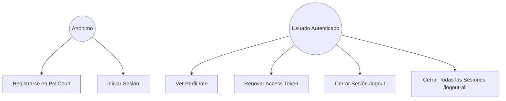
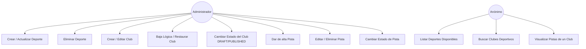
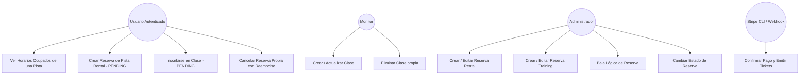

# Casos de Uso - PoliCourt

Este documento describe detalladamente los casos de uso del sistema **PoliCourt**, identificando los actores, los objetivos y las interacciones dentro de la arquitectura de microservicios (Spring Boot y FastAPI).

---

## 1. Actores del Sistema

| Actor | Descripción |
|---|---|
| **Anónimo / Visitante** | Usuario no autenticado que explora la plataforma. |
| **Usuario Autenticado (Cliente)** | Usuario que realiza reservas de pistas o se inscribe en clases. |
| **Monitor** | Entrenador o profesor que imparte clases en el club. |
| **Administrador** | Responsable de la gestión completa de clubes, deportes, pistas y reservas. |
| **Pasarela de Pagos (Stripe Webhook)** | Servicio externo que confirma los pagos de forma asíncrona. |

---

## 2. Diagramas de Casos de Uso (Mermaid)

### 2.1 Gestión de Usuarios y Autenticación

Este módulo maneja el acceso y la seguridad de la plataforma.

---

### 2.2 Gestión Deportiva y Recursos (Clubs, Deportes, Pistas)

Tanto la lectura como la administración de los recursos del club.

---

### 2.3 Reservas y Pagos de Pistas y Clases

Uno de los módulos más críticos del sistema que involucra la integración con Stripe para confirmar pagos.

---

## 3. Detalle de los Casos de Uso Principales

### UC19: Crear Reserva de Pista (Rental) y Pago
- **Actor Principal**: Usuario Autenticado
- **Precondiciones**: Usuario logueado, la pista seleccionada debe estar `PUBLISHED` y el horario libre.
- **Flujo Principal**:
  1. El usuario selecciona pista, fecha y hora.
  2. El sistema valida la disponibilidad.
  3. El sistema crea la reserva con estado `PENDING`.
  4. El sistema crea un `PaymentIntent` en Stripe y devuelve el `clientSecret` al frontend.
  5. El usuario completa el pago en el frontend.
  6. Stripe notifica mediante webhook la confirmación del pago (`payment_intent.succeeded`).
  7. El backend actualiza la reserva a `CONFIRMED` y emite los tickets correspondientes.

### UC20: Inscribirse en Clase
- **Actor Principal**: Usuario Autenticado
- **Precondiciones**: Usuario logueado, la clase debe estar activa y tener plazas disponibles.
- **Flujo Principal**:
  1. El usuario solicita la inscripción a una clase.
  2. El sistema valida plazas libres y crea un intento de inscripción temporal.
  3. El sistema genera el `PaymentIntent` de Stripe.
  4. Tras la confirmación del pago en Stripe, el webhook confirma la inscripción definitiva del usuario.

### UC21: Cancelar Reserva Propia
- **Actor Principal**: Usuario Autenticado
- **Precondiciones**: La reserva debe pertenecer al usuario y estar en estado `CONFIRMED`.
- **Flujo Principal**:
  1. El usuario solicita cancelar su reserva.
  2. El sistema valida la política de cancelación (mínimo 3 horas de antelación).
  3. Si cumple, el sistema realiza el reembolso y cambia el estado de la reserva a `CANCELLED`.

---

## 4. Gestión por Microservicios (Spring Boot vs FastAPI)

La plataforma divide responsabilidades para maximizar la escalabilidad.

### Spring Boot (Servicio Principal)
- Control de seguridad y autenticación (Spring Security + JWT).
- Ciclo de vida completo de Reservas y Pagos.
- Persistencia e integridad referencial de usuarios, clubes y pistas.
- Procesamiento de Webhooks de Stripe.

### FastAPI (Servicio Complementario)
- Operaciones rápidas de consulta y búsqueda avanzada de Deportes, Pistas y Clubes.
- APIs ligeras y de alta velocidad para consumo del frontend.
